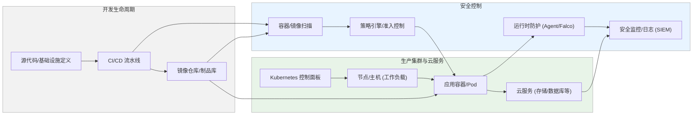

# 全面洞察业界主流厂商，详细分析Cloud Native Security 的架构体系

# 执行摘要  
随着云计算和容器化的迅猛发展，云原生安全需求日益增长。业界主流厂商已推出以**CNAPP**（Cloud Native Application Protection Platform）为核心的综合解决方案，以覆盖开发、构建、部署、运行的全生命周期安全。本文全面梳理了Aqua Security、Palo Alto Networks（Prisma Cloud）、Sysdig、Trend Micro、Tenable（含Claroty）、Anchore、Snyk、Falco/Tracee（CNCF开源项目）以及AWS/GCP/Azure等云厂商原生安全服务在容器安全、Kubernetes安全、Serverless安全、镜像与依赖扫描、运行时检测、网络与身份策略、合规审计、供应链安全、CI/CD集成、可观测性等方面的架构与功能。对比分析包括覆盖面、静态扫描与动态检测能力、误报率与可解释性、性能开销、运维复杂度、多云/混合云支持、合规性支持、开源程度与社区活跃度、典型客户案例及各自优势/劣势和适用场景。本文通过表格量化比较关键属性，辅以Mermaid示意图展示典型数据流和网络权限示例，并给出分阶段PoC落地路线图和评估指标，重点参考厂商官方文档、白皮书及CNCF安全白皮书等权威资料。假设目标为多云/混合云环境下中大型企业级应用，旨在为规划云原生安全方案提供深入参考和实践指南。

## 主流厂商安全产品概述  
- **Aqua Security**：Aqua 是较早提出CNAPP理念的厂商，强调“从代码到云”全生命周期防护。平台采用**混合部署**：Agent（Aqua Enforcer）以容器（或主机）形式运行，实时监测应用行为；同时提供无代理扫描和API集成（Agentless）以检测镜像漏洞、K8s配置和IaC misconfig等。Aqua 核心组件包括控制台、扫描器（集成Trivy开源扫描器）、运行时探针、DTA（动态威胁分析）模块等，数据流涵盖CI/CD到生产环境。其**信任边界**主要在于容器内（Enforcer将容器纳入可信域）和控制平面，平台可扩展到多集群与多云部署。Aqua支持主流公有云（AWS/Azure/GCP）、各种K8s发行版及容器平台。功能亮点在于**全面扫描、合规基线检查**和强大的策略引擎；优点是覆盖面广、企业级成熟，缺点是规模较大时资源开销和复杂度较高。Aqua在500多家大型企业（包括金融、制造、政府等）有应用案例。  
- **Palo Alto Networks Prisma Cloud**：定位为唯一的“代码到云”CNAPP。提供模块化组件：IaC安全、SCA（软件构成分析）、Secrets管理、CI/CD安全、CSPM、CIEM（权限管理）、无代理主机/容器扫描、API可视化、DSPM（数据安全态势）等。Prisma 在运行时层面支持云威胁检测、主机安全、容器安全、Serverless安全和WAF/API防护。架构上主要**Agentless**（通过云API、登记库Webhook进行无代理扫描），并可部署**Defender Agent**在工作节点提供深度防护。它支持多种部署模式（SaaS和容器化）及多云环境，并强调AI驱动的风险优先级（Prisma Cloud Copilot）。Prisma Cloud 的优势在于功能齐全、可横跨云平台，缺点在于产品体系庞大，运营和定价相对复杂。典型客户包括金融机构和大型企业（如Global Atlantic金融集团使用Prisma Cloud来统一多云安全可视性）。  
- **Sysdig**：以**运行时防护为核心**的CNAPP供应商。Sysdig Secure 平台基于开源Falco规则引擎，使用DaemonSet收集内核级系统调用、容器和K8s元数据，提供实时检测和响应。Sysdig主打**实时可见性+AI**：通过埋点监控云资产活动，将运行时洞察与静态漏洞/配置结果关联，过滤“理论威胁”而聚焦真正可利用风险。其平台由监控agent、后端云服务和AI助手（Sysdig Sage）组成。Sysdig强调多层次威胁检测（ML行为分析 + Falco规则+MLDrift），并通过攻击图（Cloud Attack Graph）关联跨域风险。支持AWS/GCP/Azure环境以及Kubernetes（EKS/GKE/AKS/OpenShift/Tanzu等）。优势为**偏向运行时监测**，对复杂攻击和后渗透行为检测能力强；缺点是对CI/CD前置扫描能力相对弱一些，更适合与现有扫描工具配合使用。BigCommerce 等互联网企业已实用Sysdig CNAPP减少响应时间和漏洞数量。  
- **Trend Micro Cloud One**：Trend Micro将云原生安全拆分为多个服务，其中**Container Security**专注于镜像扫描和上线前检查，**Workload Security**负责容器与主机的运行时防护。Container Security 可作为K8s Pod部署（通过Helm Chart），提供**持续扫描**、**策略式准入控制**和与CI/CD集成的API。它集成Snyk引擎以加强开源依赖扫描。运行时方面，Cloud One Workload Security在节点上部署Agent或Sensor，提供实时防护、漏洞屏蔽和网络流量检测。Trend解决方案适配多种K8s平台（EKS/AKS/GKE/OpenShift等）。优点是分层清晰：前置扫描与Runtime分离，可按需部署；缺点是需要配置多套产品，且需额外购买。行业客户多为金融、电商等。  
- **Tenable/Claroty**：Tenable One 云暴露风险管理平台包含CNAPP组件（Tenable Cloud Security/CEM）和CIEM等。其CNAPP融合了**KSPM/CSPM**和**云漏洞管理**功能，支持连接第三方工具并自带传感器采集数据。Tenable重点突出“曝光风险分析”，提供风险优先级评估和基于攻击路径的暴露管理。由于Tenable原始擅长漏洞管理，其CNAPP在漏洞发现和云配置检查方面较为成熟，但运行时检测较弱（更多依赖日志和审计）。Tenable还拥有Claroty（OT安全）并购，适用于涵盖OT/IoT的混合环境。Tenable One合规支持丰富（如 PCI-DSS、SOC2等基准），并提供大量安全合规扫描器。  
- **Anchore**：Anchore Engine（开源）和Anchore Enterprise专注于**容器镜像静态扫描和SBOM管理**。架构上为服务化扫描平台，可部署在Kubernetes中或作为SaaS使用。核心组件包括扫描引擎、策略引擎、数据库、API等。Anchore生成镜像的SBOM，检测镜像中的漏洞、恶意软件、密钥泄露及合规性问题，支持CVE数据库和自定义策略。它强调“**低误报、高可修复性**”：通过补丁层关联减少误报，并提供详细修复建议。与CI/CD深度集成，可在构建或镜像推送时触发扫描，并通过Webhook或通知与流程联动。Anchore优点是专注于镜像生命周期安全、企业合规（FedRAMP/NIST）支持好；缺点是不提供运行时监控，仅扫描。典型客户多为政府和关注合规的组织。  
- **Snyk**：开发者优先的应用安全平台，产品线包括**Snyk Open Source**（SCA）、**Snyk Code**（SAST）、**Snyk Container**、**Snyk IaC**等。Snyk Container 专门扫描容器镜像和K8s工作负载，通过CI/CD集成发现镜像中OS和应用依赖漏洞，提供基于上下文的优先级和一键修复建议。它无需代理，主要通过CLI/SaaS API运行在开发流程中。Snyk的特点是**易用性强，社区活跃**，深度集成GitHub等开发工具。但由于侧重静态分析，运行时安全能力有限。典型客户为互联网、软件企业，倾向于左移安全的开发团队。  
- **Falco/Tracee（开源）**：作为CNCF安全子项目，Falco 和 Tracee 代表了开源运行时监控思路。**Falco**（原由Sysdig开发）通过**内核模块或eBPF探针**检测系统调用、文件变化、网络流量等是否异常，并基于规则触发告警。它提供丰富默认规则集，可自定义告警策略，广泛用于Kubernetes和Linux主机安全。**Tracee**（Aqua开源）同样基于eBPF技术，主要监控系统调用和容器内部事件，用于实时安全检测和取证。两者都是无代理（以DaemonSet方式运行），性能开销较低，允许精细行为分析。由于需要对内核打补丁或提升权限，部署时需考虑**最小权限原则**（如只赋予捕获探针所需的Capabilities）。它们的优点是免费开源、社区活跃、可高度定制；缺点是告警管理和全生命周期集成需自行搭建，且误报需要手动调优。  
- **云厂商原生安全服务（AWS/GCP/Azure）**：各大云厂商提供多种安全服务，通常分为**CSPM/KSPM**、**CWPP/RASP**、**SIEM**等。例如，AWS 的 Amazon Inspector（漏洞扫描、映像扫描）和GuardDuty（云威胁检测）分别提供漏洞管理和运行时监控。AWS Inspector 集成入CI/CD，可扫描ECR中的容器镜像并持续监控EC2/容器漏洞；GuardDuty通过分析CloudTrail、VPC Flow、DNS日志等来检测异常行为。Azure 的 Microsoft Defender for Cloud 具备CSPM、容器注册表扫描、AKS防护、Azure Policy合规等功能；Azure AD、Key Vault、DDoS防护等为身份和网络安全提供支持。GCP 的Security Command Center（SCC）整合资产发现、漏洞扫描（Container Analysis for GCR）、云审计以及Threat Detection；Binary Authorization可实现K8s镜像白名单。三大云均支持加密、IAM、多租户隔离及合规报告（如PCI/DORA）。它们的优势是与云平台深度集成、无需额外部署组件，但功能往往较通用，对多云环境支持不如独立厂商灵活。

## 架构与数据流对比  
下表对比了各方案的关键属性和评分（满分5为最佳），涵盖覆盖范围、检测能力、误报率、性能开销、运维复杂度、多云兼容性、合规支持、开源程度等维度（评分基于公开资料和业界评估，非厂商宣传）。  

| 特性 / 厂商          | Aqua Security  | Palo Alto Prisma | Sysdig Secure  | Trend Micro Cloud One | Tenable One   | Anchore       | Snyk           | Falco/Tracee    | 云原生服务 (AWS/Azure/GCP) |
| -------------------- | -------------- | ---------------- | -------------- | --------------------- | ------------- | ------------- | -------------- | -------------- | ------------------------ |
| **覆盖面**           | ★★★★★ (镜像+配置+运行)  | ★★★★★ (全生命周期) | ★★☆☆☆ (偏运行时) | ★★☆☆☆ (镜像+Runtime) | ★★★★☆ (配置+漏洞) | ★★☆☆☆ (仅镜像扫描) | ★★★☆☆ (镜像+依赖) | ★☆☆☆☆ (仅Runtime) | ★★★★☆ (配置+基础服务) |
| **检测类型**         | 静态+行为+实时 | 静态+行为+实时 | 运行时+行为     | 静态+运行时         | 静态+配置    | 静态           | 静态           | 行为             | 静态+行为+SIEM      |
| **误报率**           | ★★★☆☆ (策略可调) | ★★★☆☆ (AI优先)    | ★★★★☆ (过滤噪声) | ★★☆☆☆ (依赖签名库)   | ★★★☆☆        | ★★★★★ (低误报) | ★★★☆☆        | ★★★★☆ (规则驱动需调优) | ★★☆☆☆ (通用告警)  |
| **可解释性**         | ★★★☆☆ (可视化报告) | ★★★★☆ (AI指引)    | ★★★★☆ (关联视图)   | ★★★☆☆         | ★★★☆☆        | ★★★★★ (清晰报告) | ★★★★☆         | ★★★☆☆ (纯告警)     | ★★☆☆☆            |
| **性能开销**         | ★★☆☆☆ (Enforcer**较重**)  | ★★★☆☆ (Agentless扫描+少量agent) | ★★☆☆☆ (内核探针) | ★★★☆☆ (Runtime agent) | ★★★☆☆        | ★★★★☆ (轻量扫描)  | ★★★★☆          | ★★★★★ (几乎无)      | ★★★★★ (云服务，无负担)    |
| **运维复杂度**       | ★★☆☆☆ (部署需规划)    | ★★☆☆☆ (SaaS驱动)   | ★★☆☆☆ (须管理agent) | ★★★☆☆ (多组件)    | ★★★☆☆        | ★★★★☆ (需集成CI)  | ★★★★☆ (集成CI较易) | ★★★★☆ (规则需维护)   | ★★★☆☆ (依赖云技能)  |
| **支持云平台**       | AWS/Azure/GCP/混合 | AWS/Azure/GCP/混合 | AWS/Azure/GCP/混合 | AWS/Azure/GCP     | AWS/Azure/GCP | 任意(镜像仓库)  | 任意(集成仓库)   | 任意(K8s/主机)      | AWS/Azure/GCP    |
| **支持K8s发行版**    | OpenShift/Tanzu等 | EKS/GKE/AKS等     | EKS/GKE/AKS等   | EKS/GKE/AKS等      | EKS/GKE/AKS等 | -             | EKS/GKE/AKS等  | EKS/GKE/AKS等     | 原生支持EKS/GKE等  |
| **合规支持**         | PCI/DORA/SOC2等 | PCI/DORA/SOC2等   | PCI/DORA/SOC2等 | PCI/DORA/SOC2等    | PCI/DORA/SOC2  | CIS/NIST/CMMC 等 | N/A           | 规则自定义         | 原生基准(PCI,ISO) |
| **开源程度**         | ★★★☆☆ (Trivy 开源)  | ★★☆☆☆ (部分组件)   | ★★★★☆ (Falco开源)   | ★★☆☆☆ (一部分)     | ★★☆☆☆        | ★★★★★ (开源引擎)  | ★★★★★ (社区版)    | ★★★★★ (开源项目)    | ★☆☆☆☆            |
| **社区活跃度**       | ★★★☆☆           | ★★☆☆☆             | ★★★★★           | ★★☆☆☆             | ★★☆☆☆        | ★★★★☆           | ★★★★☆           | ★★★★★            | ★★★☆☆            |
| **典型客户与案例**   | 大型金融、电信、医疗等 | 全球银行、保险、科技（Global Atlantic案例） | 互联网电商（BigCommerce案例） | 金融、电信、能源企业等   | 企业级用户、政府 | 政府、军工、IT厂商 | 软件企业、互联网   | 开源社区、科研   | 各云平台用户       |
| **优势**             | 全面平台化、持续防护 | 功能最齐全、AI驱动风险优先 | 实时检测强（Falco规则+AI） | 镜像安全生态完善（集成Snyk等） | 漏洞管理经验丰富 | 专注容器扫描、低误报 | 开发者友好、易用   | 开源免费、实时可定制 | 与云深度集成      |
| **劣势**             | 平台复杂度高、资源占用大    | 产品线庞大、学习成本高       | 偏重运行时、静态检测能力弱 | 产品多需单独配置    | 运行时检测能力弱 | 无运行时防护      | 不支持运行时       | 只提供检测告警，无自动化响应 | 功能较通用         |
| **适用场景**         | 多云企业级、大规模部署     | 需全生命周期安全、多云场景   | 强调快速检测及响应的场景    | 依赖容器镜像生命周期安全 | 云漏洞曝光管理    | 注重合规和开发流程的组织 | 追求DevSecOps的开发团队 | 预算敏感或需要定制检测 | 原生云应用的快速安全强化 |

> **注：**表格评分为综合评估，★越多越优；“检测类型”中“静态”指代码/镜像扫描，“行为”指行为分析检测，“实时”指运行时威胁防护。

## 架构示意与典型部署  


图中展示了典型的DevSecOps工作流和Kubernetes集群结构：开发者提交代码后，经由**CI/CD流水线**构建容器镜像并推送到镜像仓库。安全平台在构建阶段进行**镜像静态扫描**（C1），并在部署时通过**策略引擎/准入控制**（C2）筛选合规镜像。最终在生产集群中，应用容器部署在Kubernetes节点上（S3），云服务（如存储、数据库）在旁提供功能。集群运行时部署**防护Agent或Falco**（C3）捕获系统调用、网络流量等行为数据；同时日志和监控（C4）汇总包括容器、云服务和安全告警日志。**信任边界**上，应用容器和Node主机之间、集群与外部网络之间需严格限制权限和网络访问（例如使用K8s RBAC、Pod Security Policy、Calico等网络策略）。在部署示例中，CI/CD Runner、容器运行时和监控服务分别作为独立服务部署，并通过最小权限的ServiceAccount和安全组规则进行隔离。

## 推荐落地路线图  
为确保安全项目落地可控，建议分阶段进行PoC和试点部署：  

1. **需求与范围确认**：明确业务场景、资产清单和安全目标，选取关键工作负载与典型团队作为试点对象。识别首要保护需求（如镜像漏洞、K8s配置或运行时威胁）。  
2. **技术评估与PoC准备**：针对已选厂商或方案（例如选定的CNAPP产品或工具组合）进行性能与功能评估，包括：集成性（与CI/CD、云平台、IAM的兼容）、检测覆盖、误报率和运维成本。制定测试用例（漏洞注入、模拟攻击、配置错漏等）。  
3. **CI/CD阶段集成**：在开发流水线中集成镜像扫描和IaC扫描工具（如Anchore/Snyk/Inspector等），调整扫描策略和阈值。评估扫描时间和对开发流程的影响。采集指标：扫描发现数、阻塞/警告率、扫描速度。  
4. **运行时部署测试**：在测试或边缘环境中部署运行时监测组件（Falco、Trend Agent、Sysdig 等）。配置K8s安全控制（PodSecurityPolicy、NetworkPolicy）并开启Agent。进行攻击仿真（如异常行为、漏洞利用）验证检测效果。采集指标：检测率、误报率、性能开销（CPU/内存）、网络延迟。  
5. **风控分析与优化**：对发现的安全事件进行筛选和分类，结合**风险优先级**（如CVSS、漏洞是否被利用）评估误报。调优策略和规则（如白名单、告警抑制）以降低噪音。与开发团队协作，制定漏洞修复流程和告警响应机制。  
6. **合规性审计模拟**：利用系统内置合规扫描（如CIS、PCI基准）生成审计报告，检查是否满足组织或监管要求。必要时对接SIEM日志，确保审计痕迹完整。  
7. **总结评估与推广**：基于PoC数据评估各方案的适用性：如检测覆盖率、误报情况、运维复杂度和成本效益。编制Proof-of-Concept报告，提出正式部署建议。  
8. **逐步扩展部署**：根据评估结果在更多环境中放大部署，如生产K8s集群、更多开发团队或多云环境。持续监控上述指标变化，建立定期评审与优化机制。  

### 评估指标  
- **安全效益**：检测到的真实风险事件数、漏洞修复率、MTTR（平均修复时间）改善、合规缺陷率降低等。  
- **系统性能影响**：扫描耗时、资源占用提升（CPU/内存/网络）、网络吞吐变化。  
- **运维成本**：额外人力、培训投入，策略/告警调优时间，产品/许可证费用。  
- **开发效率影响**：流水线阻塞次数、开发团队对告警反馈的平均响应时间。  

### 风险与缓解  
- **告警泛滥**：初期规则和阈值设置不当易导致误报。应从少量高风险检查开始，逐渐增加规则；并借助AI评分（如Sysdig Sage）或基于应用上下文的风险排序来过滤噪音。  
- **开发阻力**：严格扫描可能拖慢CI流程。缓解方法是使用增量扫描、在质量门控而非阻塞模式下引入检查，给开发者充分修复窗口，并提供自动修复建议（如Snyk的一键升级）。  
- **部署复杂性**：多组件集成增加复杂度。建议分步骤验证，每次只增加一类功能（先SCA，再CWPP），并采用容器化/Operator简化部署。关注权限配置，如Agent应最小权限运行（去除非必要Linux Capabilities，使用只读根文件系统等）。  
- **合规挑战**：满足不同合规框架需配置众多策略。可利用机器可读的合规基准（如CIS、NIST Secure Cloud、OpenSCAP 数据集）自动化政策管理。提前与审计部门沟通，利用工具生成报告减少人工审查成本。  

### 时间线建议  
- 第1–2个月：完成需求调研和产品选型；准备测试环境并进行PoC初步部署（CI集成、基础扫描）。  
- 第3–4个月：优化扫描策略、部署运行时防护；进行红队演练或攻击模拟，收集效果指标；开始合规检查测试。  
- 第5–6个月：综合评估，撰写试点报告，调整方案后推动在生产环境逐步上线；并进行技术培训和运营文档编制。  

## 参考资料  
- Aqua Security 官网及白皮书。  
- Palo Alto Networks Prisma Cloud 产品说明与博客。  
- Sysdig Secure 官方CNAPP介绍。  
- Trend Micro Cloud One Container Security 产品资料。  
- Anchore Enterprise 产品白皮书。  
- Snyk Container 文档。  
- Falco 中文介绍；Tracee 应用指南。  
- AWS EKS 运行时安全最佳实践；AWS Inspector 发布公告。  
- CNCF 云原生安全白皮书（中文版）。  
- 十大业界研究报告与客户案例（Gartner、Forrester、云厂商文档等）。  

以上来源综合了厂商官方文档、开源项目文档和权威白皮书，以确保分析的全面性和准确性。


# 云原生安全未来架构演进（2026-2032）深度分析

如果观察过去十年的云安全演进，会发现一个非常明显的发展路径：

> **Infrastructure Security → Cloud Security → Cloud Native Security → AI Native Security → Autonomous Security（自主安全）**

未来5~8年，云原生安全已经不再只是保护 Kubernetes，而是成为 **AI时代数字基础设施（Cloud + AI + Agent + Data）的统一安全底座**。

---

# 一、云原生安全为什么进入下一阶段？

目前（2026）的CNAPP已经解决了很多问题：

例如：

* CSPM
* CWPP
* CIEM
* Container Security
* KSPM
* DSPM
* API Security
* IaC Security

但是仍然存在大量痛点。

例如：

## 1）安全能力仍然碎片化

虽然大家都说CNAPP。

实际上很多厂商只是：

```
多个产品
↓

统一Portal

↓

CNAPP
```

真正的数据仍然独立。

例如

IAM

一个数据库

Runtime

一个数据库

K8S

一个数据库

DSPM

一个数据库

Risk

一个数据库

攻击路径

一个数据库

这导致：

无法真正进行关联分析。

---

## 2）安全还是"发现风险"

今天大多数CNAPP：

都是告诉你：

这里有漏洞

这里配置错误

这里权限过高

但是：

不知道

> 下一步怎么办？

例如：

```
Pod漏洞

↓

是否能够提权？

↓

是否能够访问Secret？

↓

是否能够访问S3？

↓

是否能够横向移动？

↓

是否能够攻击LLM？

```

很多平台不能真正推理。

---

## 3）安全无法理解业务

未来：

同一个漏洞：

对于：

测试环境

生产环境

AI训练集

价值完全不同。

但是今天：

CVSS

仍然是核心。

未来一定不是。

---

## 4）AI工作负载暴增

未来新增资产：

不仅有：

VM

Pod

Container

还有：

Agent

LLM

Prompt

Memory

MCP

A2A

RAG

Embedding

Vector DB

Model Gateway

Inference Endpoint

全部进入资产体系。

传统CNAPP根本无法覆盖。

---

# 二、未来架构总体演进方向

未来行业几乎都会演进成：

```
                   Security Fabric

                           │

        ┌─────────────────────────────┐
        │ Unified Security Knowledge Graph │
        └─────────────────────────────┘

      Risk Engine      AI Engine     Policy Engine

      Runtime Graph    Identity Graph    Data Graph

                    Security Agent

        Prevention Detection Response Recovery
```

真正核心：

已经不是某个产品。

而是：

**Security Graph（安全图谱）**

整个行业都会围绕Graph发展。

---

# 三、未来第一大方向：Graph Native Security

这是未来最大的变化。

目前：

CNAPP：

```
Asset Inventory
```

未来：

Graph。

例如：

```
User

↓

Role

↓

IAM Policy

↓

Pod

↓

Namespace

↓

Cluster

↓

Secret

↓

Database

↓

LLM

↓

Prompt

↓

Memory

↓

Vector DB

↓

Customer Data
```

所有资产：

形成：

```
Knowledge Graph
```

未来：

安全分析全部基于Graph。

例如：

```
Find：

能够访问生产数据库

并且

拥有管理员权限

并且

存在高危漏洞

并且

正在运行AI Agent

并且

访问客户PII

```

Graph可以一秒钟算出来。

未来：

所有大厂都会Graph Native。

---

# 四、第二大方向：Attack Path成为核心

今天：

漏洞数量：

几百万。

真正危险：

几十个。

为什么？

因为：

真正危险的是：

Attack Path。

例如：

```
Internet

↓

Ingress

↓

API

↓

Pod

↓

Secret

↓

IAM

↓

S3

↓

LLM

↓

Production
```

未来：

安全平台不会告诉你：

多少漏洞。

而是：

告诉你：

真正可攻击路径。

例如：

```
Attack Chain：

4 steps

Success Probability：

92%

Business Impact：

High

```

未来：

Attack Graph

会替代：

漏洞管理。

---

# 五、第三方向：Risk Native

今天：

CVSS：

几乎没价值。

未来：

风险：

来自：

多个维度。

例如：

```
Risk

=

Exposure

×

Identity

×

Business

×

Data

×

Runtime

×

AI

×

Threat Intelligence
```

例如：

同样一个漏洞：

开发环境：

Risk=5

生产：

Risk=90

AI训练集：

Risk=98

以后：

风险：

全部动态计算。

---

# 六、第四方向：AI Native Security

这是2027以后最大变化。

未来保护对象：

已经变成：

```
Foundation Model

LLM Gateway

Prompt

MCP

A2A

Agent

Tool

Plugin

Memory

Planning

Reasoning

Workflow
```

安全能力：

新增：

Prompt Firewall

Agent Firewall

Tool Permission

Memory Security

Model Isolation

Reasoning Audit

Tool Sandbox

Context Verification

Hallucination Detection

Agent Identity

Agent Behavior

Agent Runtime

Agent Governance

这已经超越传统CNAPP。

---

# 七、第五方向：Identity成为第一安全边界

未来：

Perimeter消失。

Network：

越来越不重要。

真正重要：

Identity。

例如：

```
Human

↓

Machine

↓

Workload

↓

Service

↓

Container

↓

Pod

↓

AI Agent

↓

Robot

↓

MCP Server

```

全部需要Identity。

未来：

IAM

升级：

Universal Identity。

---

# 八、第六方向：Runtime成为真正核心

以前：

安全：

扫描。

未来：

运行时。

例如：

未来：

95%攻击：

发生在：

Runtime。

因此：

未来：

Runtime：

包括：

Runtime AI

Runtime Agent

Runtime API

Runtime Identity

Runtime Data

Runtime Model

Runtime Network

全部统一。

---

# 九、第七方向：Security Agent

未来：

安全平台自己就是Agent。

例如：

今天：

```
发现漏洞

↓

人工修复
```

未来：

```
发现漏洞

↓

AI分析

↓

AI生成Patch

↓

AI验证

↓

AI上线

↓

AI观察

↓

AI回滚

```

未来：

SOC：

大量自动化。

Security Copilot：

只是第一步。

真正未来：

Autonomous SOC。

---

# 十、第八方向：Data Security成为中心

未来：

数据：

价值最高。

未来：

安全中心：

不是：

Container。

不是：

VM。

而是：

Data。

未来：

DSPM

成为：

中心能力。

Graph：

最终都会围绕：

```
Sensitive Data
```

建立。

---

# 十一、第九方向：Agentic Security（未来最大的趋势）

未来：

攻击者：

Agent。

防御者：

也是Agent。

形成：

```
Red Agent

↓

Blue Agent

↓

Purple Agent

↓

SOC Agent

↓

Patch Agent

↓

Compliance Agent

↓

Forensic Agent

↓

IR Agent
```

整个SOC：

Agent化。

---

# 十二、第十方向：Security Mesh Fabric

未来：

所有安全产品：

不是：

Point Product。

而是：

Mesh。

例如：

```
Identity

Runtime

Cloud

API

Container

AI

Data

Network

SIEM

SOAR

XDR

全部

↓

Security Mesh
```

统一：

Graph。

统一：

Policy。

统一：

Identity。

统一：

Risk。

---

# 十三、未来云原生安全参考架构（Cloud + AI Native）

```text
                    Autonomous Security Platform
────────────────────────────────────────────────────────

             AI Security Brain（统一安全大脑）

          Security LLM + Reasoning + Planner

────────────────────────────────────────────────────────

        Security Knowledge Graph（统一知识图谱）

Identity Graph

Runtime Graph

Attack Graph

Data Graph

AI Graph

Business Graph

Compliance Graph

────────────────────────────────────────────────────────

      Unified Policy Engine（统一策略引擎）

OPA

Rego

Cedar

AI Policy

Business Policy

Runtime Policy

Identity Policy

────────────────────────────────────────────────────────

         Universal Security Runtime

Cloud Runtime

Container Runtime

K8S Runtime

Serverless Runtime

API Runtime

AI Runtime

Agent Runtime

────────────────────────────────────────────────────────

Protection Layer

AI Firewall

Container Security

K8S Security

DSPM

CIEM

CSPM

CWPP

KSPM

API Security

Identity Security

Supply Chain Security

────────────────────────────────────────────────────────

Cloud

Multi Cloud

Edge

AI Cluster

GPU Cluster

Agent Platform

Developer Platform
```

---

# 十四、未来能力成熟度路线图（2026-2032）

| 阶段            | 核心能力                      | 架构特征                                               |
| ------------- | ------------------------- | -------------------------------------------------- |
| **2026**      | CNAPP 整合                  | CSPM、CWPP、CIEM、DSPM 等能力平台化                         |
| **2027**      | Graph Native              | 全局安全知识图谱、攻击路径分析、统一风险评分                             |
| **2028**      | AI Native                 | AI 工作负载、智能体、模型与推理链安全成为平台原生能力                       |
| **2029**      | Agentic Security          | 多安全智能体协同，实现自动调查、修复与策略优化                            |
| **2030**      | Autonomous Security       | 基于风险与业务上下文的闭环自主防御                                  |
| **2031-2032** | Security Operating System | 安全能力从“产品集合”演进为覆盖云、数据、AI 与智能体的统一安全操作系统（Security OS） |

# 核心判断

未来云原生安全的竞争焦点，将从“功能覆盖”转向“平台智能化与自主化”。下一代领先架构预计将具备以下特征：

1. **Graph Native**：以统一安全知识图谱连接身份、资产、数据、运行时、AI 工作负载和业务上下文，支持全局关联分析。
2. **Risk Native**：以动态风险而非静态漏洞为核心，结合攻击路径、资产价值、身份权限和威胁情报进行实时优先级排序。
3. **AI Native**：将大模型、智能体、向量数据库、MCP、工具调用等对象纳入统一安全治理体系。
4. **Runtime Native**：持续监控运行时行为，实现对容器、Kubernetes、API、AI Agent 等工作负载的实时检测与响应。
5. **Autonomous Native**：利用安全智能体完成风险分析、修复建议、自动变更验证和闭环处置，逐步实现自主安全运营。

**长期来看，未来的云原生安全平台将不再是传统意义上的 CNAPP，而是一个融合知识图谱、AI 推理、安全策略和自主执行能力的 Security OS，为云、数据和 AI 基础设施提供统一的安全运行平台。**


这张架构图本质上描述的是**下一代 Cloud Native Security（Security OS）参考架构**。相比传统 CNAPP，它最大的变化是：

> **从"多个安全产品"升级为"统一安全智能平台（Security Operating System）"，以 AI + Knowledge Graph + Security Agents 为核心。**


下面按照**自底向上**逐层分析每个架构元素及其职责、输入输出、关键技术与未来演进方向。

---

# 一、整体架构逻辑

整个架构可以理解为七层。

```text
业务用户
        ↑
AI Security Brain
        ↑
Security Knowledge Graph
        ↑
Policy + Governance
        ↑
Security Agents
        ↑
Unified Runtime Security
        ↑
Cloud Native Infrastructure
```

真正的数据流如下：

```text
Cloud

↓

Collect

↓

Knowledge Graph

↓

AI分析

↓

Risk

↓

Security Agent

↓

自动响应

↓

持续学习
```

形成闭环：

```text
Observe

↓

Reason

↓

Decide

↓

Act

↓

Learn
```

这就是未来 Autonomous Security。

---

# 二、Threat Sources（威胁来源）

左侧代表所有安全事件来源。

包括：

## ① External Attacker

例如：

APT

Bot

Ransomware

Supply Chain

Web攻击

API攻击

AI攻击

输入：

```text
Internet

↓

Ingress

↓

API Gateway

↓

Kubernetes

↓

Application
```

---

## ② Insider Risk

包括：

开发人员

运维

第三方

误操作

越权

未来越来越重要。

---

## ③ Supply Chain

包括：

Github

DockerHub

PyPI

NPM

Maven

OCI Registry

CI/CD

未来：

超过40%的漏洞来自供应链。

所以：

SBOM

SLSA

Sigstore

成为标配。

---

## ④ AI Threat

未来新增：

Prompt Injection

Jailbreak

Tool Abuse

Memory Poisoning

RAG Poisoning

MCP攻击

Model Theft

Agent Hijack

这是未来最大的新增攻击面。

---

# 三、Security Users（使用者）

未来：

安全平台不只是SOC使用。

而是：

```text
SOC

DevSecOps

Platform Team

Cloud Team

AI Team

Data Team

Business

Compliance
```

共同使用。

因此：

平台必须支持：

RBAC

ABAC

Tenant

Workspace

Business View

---

# 四、AI Security Brain（AI安全大脑）

这是未来平台最核心。

相当于：

Security GPT。

包括：

---

## ① Security LLM

负责：

安全知识。

例如：

CVE

MITRE

ATT&CK

云配置

K8S

IAM

Threat Intelligence

支持：

问答

分析

解释

报告。

---

## ② Reasoning Engine

负责：

推理。

例如：

```text
Pod漏洞

↓

Secret

↓

IAM

↓

Database

↓

Customer Data
```

推导：

是否能够攻击。

未来：

大量采用：

Graph RAG

Reasoning

Planning

Tree Search

---

## ③ Predictive Risk

未来：

不是：

发现风险。

而是：

预测风险。

例如：

预测：

未来：

哪些Pod：

一周后最可能被攻击。

---

## ④ Attack Path

自动计算：

```text
Internet

↓

API

↓

Pod

↓

Secret

↓

IAM

↓

S3

↓

PII
```

形成：

Attack Graph。

---

## ⑤ Policy Optimizer

AI自动建议：

策略。

例如：

IAM

K8S

OPA

Network Policy

AI自己优化。

---

## ⑥ Autonomous Engine

未来：

Agent执行。

例如：

自动：

Patch

Rollback

Scale

Quarantine

Block

通知

审批。

---

# 五、Security Knowledge Graph（统一安全知识图谱）

这是未来最大的创新。

整个企业：

所有资产：

全部关联。

---

## ① Identity Graph

包含：

```text
User

Role

Service Account

OIDC

IAM

Token

Credential

```

未来：

Identity

成为第一安全边界。

---

## ② Asset Graph

包括：

VM

Container

Pod

Namespace

Cluster

Cloud

Database

Storage

API

Serverless

GPU

LLM

全部统一。

---

## ③ Attack Graph

未来：

不是：

漏洞。

而是：

攻击路径。

例如：

```text
Node

↓

Pod

↓

Secret

↓

IAM

↓

Database
```

图算法：

实时计算。

---

## ④ Data Graph

包括：

PII

PCI

PHI

Embedding

Vector

Training Data

Data Flow

数据流向。

---

## ⑤ AI Graph

未来新增：

LLM

Prompt

Memory

Tool

Agent

Workflow

MCP

Reasoning

Context

全部成为Graph节点。

---

# 六、Unified Policy & Governance

统一策略。

包含：

---

## Identity Policy

Zero Trust

Least Privilege

CIEM

JIT

PAM

---

## Data Policy

DSPM

Encryption

Masking

DLP

Retention

---

## AI Policy

未来：

Prompt

Memory

Tool

Model

Agent

均需要Policy。

例如：

Agent：

只能：

调用：

CRM。

不能：

调用：

Finance。

---

## Runtime Policy

包括：

OPA

Kyverno

Admission

eBPF

Falco

SELinux

AppArmor

---

## Compliance

自动：

ISO27001

PCI

HIPAA

NIST

等映射。

---

# 七、Security Agents（未来SOC）

未来：

SOC：

全部Agent化。

包括：

---

## Investigation Agent

自动调查。

例如：

收到告警：

自动：

查询：

IAM

Logs

Pod

API

Threat

一分钟完成调查。

---

## Remediation Agent

自动：

修漏洞。

例如：

升级镜像。

修改配置。

重新部署。

---

## Threat Hunting Agent

自动：

寻找：

IOC

TTP

异常行为。

---

## Compliance Agent

自动：

生成：

审计报告。

自动：

证据收集。

---

## Forensics Agent

自动：

保留：

Memory

Container

Pod

Network

Artifact。

---

# 八、Unified Runtime（统一运行时）

这是未来最重要的一层。

包括：

## CSPM

云配置。

---

## CWPP

工作负载保护。

---

## Container

容器。

---

## Kubernetes

KSPM。

Admission。

Runtime。

---

## API

API Security。

Schema。

Discovery。

Runtime。

---

## Data

DSPM。

---

## AI Runtime

未来新增。

包括：

Prompt Firewall

Agent Firewall

Tool Permission

Memory Guard

Inference Audit

Model Runtime

---

# 九、Cloud Native Infrastructure

最底层。

未来：

Everything as Code。

包括：

```text
AWS

Azure

GCP

OpenStack

Huawei Cloud

Alibaba Cloud

```

以及：

```text
Kubernetes

Serverless

Edge

GPU

AI Cluster

DevOps

GitOps
```

未来：

平台全部支持。

---

# 十、Business Value（右侧）

最终输出。

包括：

## 风险可视化

统一：

资产

身份

漏洞

攻击路径

AI风险。

---

## 攻击预测

未来：

不是：

检测。

而是：

预测。

---

## 自动化运营

Agent：

自动：

调查

修复

验证

关闭。

---

## 合规自动化

自动：

证据。

自动：

审计。

自动：

整改。

---

## 持续优化

形成完整闭环：

```text
Observe（观测）
      │
      ▼
Correlate（关联）
      │
      ▼
Reason（推理）
      │
      ▼
Decide（决策）
      │
      ▼
Act（执行）
      │
      ▼
Verify（验证）
      │
      ▼
Learn（学习）
      └──────────────┐
                     ▼
             持续策略优化
```

这一闭环使平台能够从传统的“告警驱动”升级为“风险驱动、自主运行”。

# 十一、未来可进一步增强的关键架构元素

为了真正达到 **2030+ Security OS** 的目标，这套架构建议再增加以下几个关键模块：

| 新增模块                            | 作用                                       | 核心技术                                           |
| ------------------------------- | ---------------------------------------- | ---------------------------------------------- |
| **Security Data Fabric**        | 构建统一安全数据总线，打通日志、事件、身份、配置、AI 上下文等异构数据     | 流式数据处理、Lakehouse、OpenTelemetry                 |
| **Risk Intelligence Center**    | 动态风险评分与业务影响分析，替代静态 CVSS                  | 攻击路径分析、业务上下文建模、威胁情报融合                          |
| **Security Digital Twin**       | 构建云环境数字孪生，在虚拟环境中进行攻击模拟和策略验证              | 图数据库、仿真引擎、攻击模拟                                 |
| **AI Trust Layer**              | 对模型、Agent、Prompt、工具调用建立可信验证机制            | 模型签名、Prompt Guard、Agent Identity、MCP 权限控制      |
| **Security Control Plane**      | 统一编排所有安全策略、智能体和执行器，形成全局控制平面              | OPA、Cedar、Workflow Engine、Policy Orchestration |
| **Developer Security Platform** | 将安全能力左移到研发流程，实现 DevSecOps 与 AI Coding 安全 | IDE 插件、CI/CD 扫描、IaC、SBOM、SLSA、代码智能体治理          |

## 十二、总体设计思想

从体系结构角度看，这张图体现了下一代云原生安全平台的五个核心设计原则：

* **统一（Unified）**：所有安全能力共享统一的数据模型、身份体系、策略和知识图谱，而不是多个孤立产品的简单集成。
* **图谱驱动（Graph Native）**：以安全知识图谱作为平台核心，实现资产、身份、数据、AI 与攻击路径的全局关联分析。
* **AI 原生（AI Native）**：AI 不仅是分析助手，更是推理引擎、策略优化器和自主执行器。
* **运行时优先（Runtime First）**：持续保护云、容器、Kubernetes、API、数据和 AI 工作负载，而不是依赖一次性扫描。
* **自主安全（Autonomous Security）**：通过多智能体协同，实现从发现风险、分析原因、制定策略到自动修复、验证和持续学习的闭环，最终演进为真正意义上的 **Security Operating System（Security OS）**。
